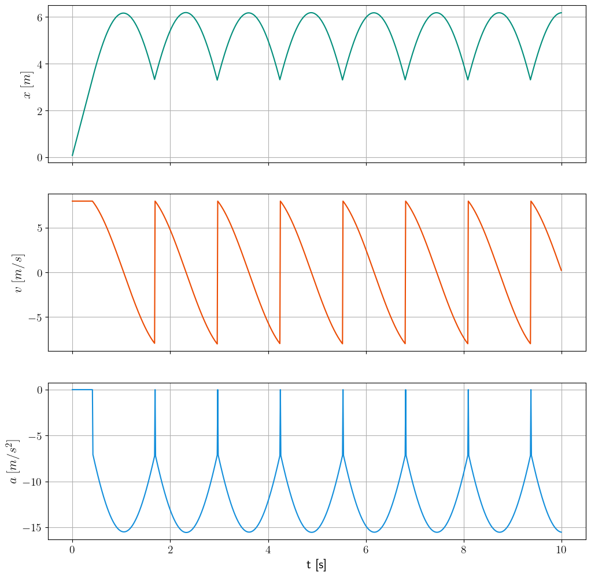

## Stick-Slip Model

The [stick-slip phenomenon](https://en.wikipedia.org/wiki/Stick%E2%80%93slip_phenomenon) is observed in various mechanical systems involving friction. 
The simulation models a mass connected to a spring connected to an external surface under relative velocity, subject to both static and kinetic friction.

 
 [^1]
 

The first picture shows the displacement $x$ of the mass. Starting from a relaxed spring, $x$ inceases linearly until the slipping condition $|F_{\text{Hook}}| > F_{\text{max}}$ is met. The mass subsequently *sticks* and *slips*. 

[^1]: [Image](https://upload.wikimedia.org/wikipedia/commons/d/d0/Stick-slip.svg)  by [Jean-Jacques MILAN](https://commons.wikimedia.org/wiki/User:Jean-Jacques_MILAN) under [CC BY-SA 3.0](https://creativecommons.org/licenses/by-sa/3.0/)